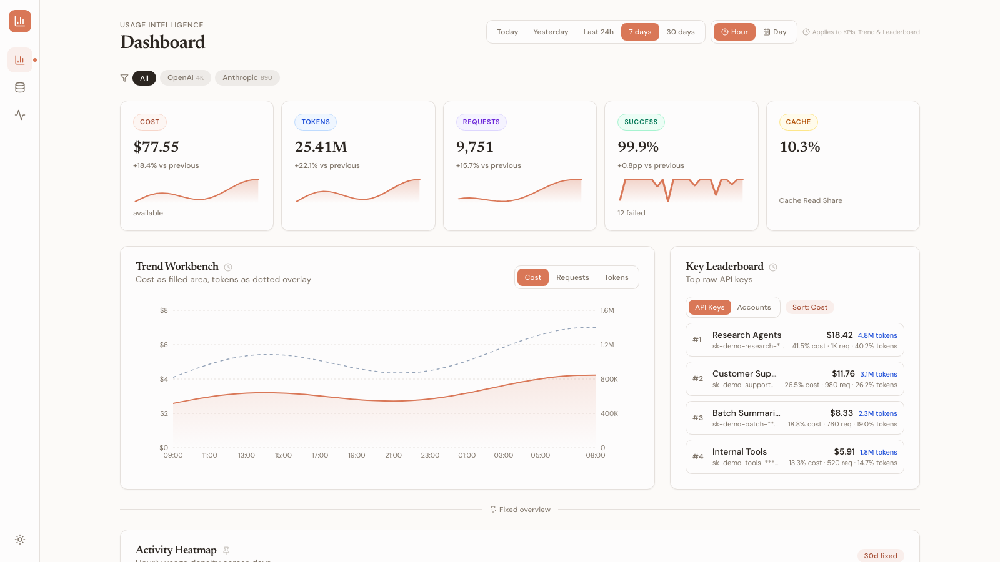
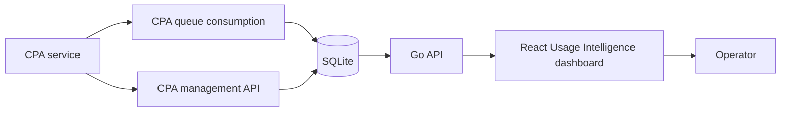

# CPA Usage

[](https://github.com/evenluo/cpa-usage/actions/workflows/verify.yml)
[](https://github.com/evenluo/cpa-usage/tags)
[](LICENSE)
[](SECURITY.md)

Self-hosted usage intelligence dashboard for CPA usage data, with shared login for `/usage` deployments, human-readable key aliases, cost, token volume, request health, and pricing reference data.



CPA Usage turns CPA usage data into a human-readable operating workspace without becoming a general CPA administration console. It keeps the stable CPA usage keeper backend foundation for queue consumption, SQLite persistence, migrations, pricing semantics, auth/session, backup, update checks, and Docker-friendly deployment, then adds a React analytics frontend for people who need to read usage patterns quickly.

## Highlights

- **Shared self-hosted login**: CPA Usage can share auth/session state with the CPA root service when deployed under `/usage`, so operators do not need a separate login loop for the usage dashboard.
- **Human-readable key aliases**: operators can label raw CPA keys with Key Aliases, read dashboards by those aliases, and still keep the masked CPA key available for traceability.

## What It Does

- **Usage Intelligence**: selected-window KPIs, hourly or daily trends, provider filters, key leaderboards, model distribution, activity heatmap, request health, and recent request evidence.
- **Reference Data**: human-readable Key Aliases and Cost Rates that make raw CPA usage data understandable without writing alias data back to CPA.
- **Operations Console**: lightweight sync, runtime, shared-login access, and logout state for the usage dashboard.
- **Self-hosted persistence**: local SQLite data, migrations, backups, and logs under the configured work directory.
- **Docker-friendly release path**: immutable GHCR version tags and deployment docs for Dokploy or other self-hosted environments.

## Quickstart

CPA Usage needs a reachable CPA service and a CPA management key. It does not ship a standalone demo backend.

```bash
cp .env.example .env
npm --prefix ./web ci
```

Edit `.env` and set at least:

```dotenv
CPA_BASE_URL=http://127.0.0.1:8317
CPA_MANAGEMENT_KEY=replace-with-your-management-key
```

Run the app locally:

```bash
make dev-backend
make dev-frontend
```

The Go server serves the built frontend assets from `web/dist` after `npm --prefix ./web run build`. For self-hosted shared login between the CPA root service and this `/usage` service, see [self-hosted shared login](docs/deploy/self-hosted-shared-login.md).

## Architecture At A Glance



Repository boundaries are intentionally small:

- `cmd/server` and `internal/*` own the Go server, CPA clients, SQLite persistence, queue consumption, auth/session, backup, and API contracts.
- `web/` owns the React, TypeScript, Vite, Tailwind, and shadcn-style analytics workspace.
- `docs/project/contract.md` and `docs/project/layout.md` are the current project-level source of truth for contribution rules and ownership boundaries.

## Deployment

Production images are published as immutable GHCR version tags. Do not deploy `latest`.

For Docker Compose, start from [docker-compose.example.yml](docker-compose.example.yml) and set `CPA_USAGE_IMAGE` to an immutable release tag such as:

```dotenv
CPA_USAGE_IMAGE=ghcr.io/evenluo/cpa-usage:v0.1.8
```

For Dokploy, this repository owns only the independent `cpa-usage` Compose app. The release workflow renders `deploy/dokploy/cpa-usage.compose.yml`, updates the Dokploy app referenced by `DOKPLOY_CPA_USAGE_COMPOSE_ID`, and deploys that app only. Adjacent CPA infrastructure such as the root CPA service, its Postgres database, and other proxy services is outside the release blast radius.

Deployment docs:

- [Dokploy release chain](docs/deploy/dokploy-release.md)
- [Self-hosted cutover runbook](docs/deploy/self-hosted-cutover-runbook.md)
- [Self-hosted shared login](docs/deploy/self-hosted-shared-login.md)

For Dokploy, set environment-specific values in Dokploy, not in git:

```dotenv
PUBLIC_HOST=<your-cpa-host>
MANAGEMENT_PASSWORD=<existing CPA management password>
CPA_USAGE_LOGIN_PASSWORD=<usage-dashboard-login-password>
AUTH_SESSION_SECRET=<random-secret-with-at-least-32-characters>
AUTH_SESSION_COOKIE_DOMAIN=<your-cpa-host>
```

## Verification

Run local checks from the repository root:

```bash
make verify-backend
make verify-frontend
```

`make verify` runs both checks. `make verify-backend` runs backend tests and `go vet`. `make verify-frontend` installs frontend dependencies with `npm ci`, then runs lint, typecheck, Vitest feature tests through `make test-frontend`, and mobile Playwright checks. `make verify-docker` builds the deployment image. GitHub Actions runs backend and frontend verification for pull requests and pushes to `main`.

Common focused targets:

```bash
make test-backend
make fmt-backend
make vet-backend
make build-backend
make test-frontend
make lint-frontend
make typecheck-frontend
make build-frontend
```

The Makefile is the canonical repository-root entrypoint for common development and verification tasks. Targets intentionally stay as thin wrappers around Go and npm commands; use the underlying tools directly for focused package or file-level work.

## Project Docs

- [Project contract](docs/project/contract.md): repository positioning, compatibility rules, naming rules, documentation rules, shared contribution invariants, and risk-matched verification policy.
- [Project layout](docs/project/layout.md): current backend package ownership, frontend ownership, and documentation source-of-truth boundaries.
- [Domain glossary](CONTEXT.md): product vocabulary for Usage Intelligence, Reference Data, Operations Console, Request Evidence, Cost Rates, and Key Aliases.
- [Architecture decisions](docs/adr/): accepted architecture decisions.
- [Contributing](CONTRIBUTING.md): local setup, development entrypoints, PR verification, and project boundaries.
- [Security policy](SECURITY.md): vulnerability reporting scope and private-data handling expectations.

## Non-Goals

CPA Usage is intentionally scoped to usage intelligence. It is not a CPA admin console, quota management surface, raw event audit log, backup browser, log inspector, or replacement for the CPA root service.
