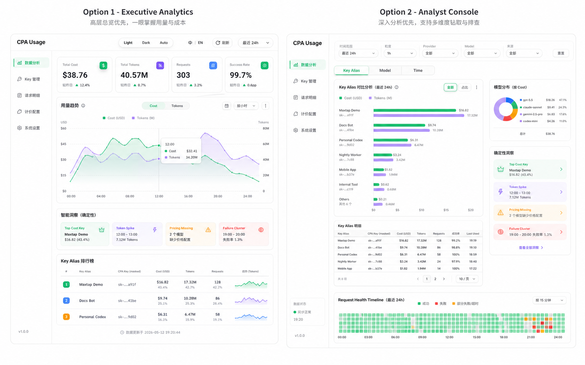

# CPA Usage Analytics Dashboard v1

## Conclusion

CPA Usage v1 will redesign the product around an analytics-first experience: one data analysis page for total usage and breakdowns, plus focused configuration pages for keys, pricing, request events, and settings. The visual direction should reference the Magic dashboard style: airy white surfaces, clear hierarchy, compact operational density, subtle borders, pill controls, and restrained accent colors.

The first version keeps CPA unchanged. CPA remains the source of raw key attribution, while CPA Usage stores local human-readable aliases and calculated cost.

## Goals

- Make total usage understandable at a glance through cost, tokens, requests, and success rate.
- Treat **Cost** and token volume as peer measurement categories.
- Support breakdowns by **Key Alias**, model, and time as the default analytics dimensions.
- Let users assign human-readable **Key Aliases** to raw **CPA Keys**.
- Keep request health available as a secondary stability analysis, not the primary dashboard story.
- Preserve traceability by always keeping a masked **CPA Key** visible when an alias exists.

## Non-Goals

- Do not write aliases back to CPA.
- Do not build bulk alias import or export in v1.
- Do not add AI-generated summaries in v1.
- Do not make the whole product a long single-page scroll.
- Do not make provider the primary analytics axis unless the user filters or drills into it.

## Information Architecture

The product navigation should separate analysis from configuration:

- **Analytics / 数据分析**: total usage, trends, breakdowns, deterministic insights, and stability.
- **Keys / Key 管理**: alias editing, key search, key metadata, usage totals, and last-used state.
- **Pricing / 计价配置**: model unit price configuration used to calculate **Cost**.
- **Events / 请求明细**: raw request event inspection for debugging and traceability.
- **Settings / 系统设置**: sync status, update check, auth, and operational settings.

## Analytics Page

The analytics page should be compact, not a long report. It should have one primary screen with a small number of high-value sections.

### Section Order

1. **Total Usage**
   - Total Cost
   - Total Tokens
   - Requests
   - Success Rate

2. **Cost and Token Trend**
   - Cost and tokens should be switchable or shown side by side.
   - Cost is the default sorting measure when pricing is complete.
   - If pricing is incomplete, token volume remains authoritative and cost should be marked partial or unavailable.

3. **Deterministic Insights**
   - Top cost key
   - Top token key
   - Cost or token spike
   - Pricing missing warning
   - Failure concentration
   - Cache or reasoning token share

4. **Breakdowns**
   - Key Alias
   - Model
   - Time
   - Provider as filter or secondary dimension

5. **Request Health Timeline**
   - Secondary stability strip.
   - Useful for spotting failure clusters, not the headline story.

## Key Alias Model

**Key Alias** is a global user-defined name for a **CPA Key**.

Rules:

- A **CPA Key** may have zero or one alias.
- Multiple **CPA Keys** may share the same alias.
- Alias does not participate in usage attribution.
- Usage attribution remains attached to the raw **CPA Key**.
- Alias is stored by CPA Usage only and is not written back to CPA.
- Alias remains available for historical usage even if the key is no longer active in CPA.
- Search and filters should match both alias and key.
- When alias exists, alias is the primary label and masked key is secondary traceability text.
- Alias edits should take effect immediately in current UI state after save.

Storage:

- Store aliases in a dedicated CPA Usage table, not on the synced usage identity row.
- Key the alias by `auth_type + identity`.
- Do not key aliases by provider, base URL, or source display metadata.
- Keep alias rows independent from `usage_identities.is_deleted` so historical usage remains readable.
- Treat `usage_identities` as synchronized CPA metadata and `key_aliases` as user-owned local display data.
- Users can clear an alias; clearing only removes the local display name and does not delete the key or historical usage.
- Alias text is trimmed, can use any human-readable characters, and is limited to 80 characters.

## Keys Page

The Keys page is the editing surface for aliases.

Required v1 behavior:

- Search by alias or key.
- Show alias as editable inline text.
- Show masked key as subtitle.
- Show provider/type badges when available.
- Show last used, total cost, and total tokens.
- Do not include bulk import/export.

## Data Capability Check

Current CPA and cpa-usage-keeper data can support most of the target experience.

### Supported by CPA Usage Events

CPA usage queue records include:

- timestamp
- latency_ms
- source
- auth_index
- tokens
- failed
- provider
- model
- model alias
- endpoint
- auth_type
- api_key
- request_id

These fields support totals, trends, request health, model breakdowns, provider filtering, event traceability, and key-based grouping.

### Supported by Keeper Storage

Keeper already persists request events with:

- provider
- endpoint
- auth_type
- request_id
- model
- model_alias
- timestamp
- source
- auth_index
- failed
- latency_ms
- input/output/reasoning/cached/total tokens

Keeper also stores usage identities, pricing settings, and derived overview/analysis aggregates.

### Existing API Coverage

Existing APIs already cover:

- overall request/token totals
- cost summary
- RPM / TPM
- time series
- model series
- request health timeline
- model analysis
- API-like grouping based on `api_group_key`
- request event list and filters

### Required API Additions

The new analytics direction needs more direct key-centric aggregation:

- Key Alias breakdown by cost, tokens, requests, success/failure, and last-used time.
- Key Alias trend series for cost and tokens.
- Key Alias plus model drill-down.
- Deterministic insight payloads.
- Alias update API.

The existing `api_group_key` analysis is not enough because it is not the same as a user-facing **CPA Key** / **Key Alias** dimension.

## Backend Reuse and Enhancement Strategy

The backend should inherit stable keeper capabilities instead of being rewritten from scratch:

- CPA usage queue consumption.
- SQLite persistence and migrations.
- Pricing settings and cost calculation semantics.
- Request event listing and filtering.
- Auth/session, backup, update check, and deployment support.

The backend should also improve areas that are not a good fit for the new product direction:

- Split key-centric analytics out from the existing broad usage aggregation path.
- Avoid adding more responsibilities to the current mixed overview/analysis repository module.
- Add explicit **CPA Key** / **Key Alias** aggregation APIs instead of relying on `api_group_key`.
- Keep deterministic insight generation in a testable backend module.
- Review memory-heavy in-process aggregation paths before expanding them for alias analytics.

The key-centric analytics implementation should be a new independent backend module, not an extension of the current broad `usage.go` aggregation file. The module should expose focused operations such as analytics summary, key breakdowns, key trends, alias-model drill-downs, and deterministic insights.

The module should prefer SQL aggregation for key/model/time-bucket statistics. In-memory processing should be limited to shaping query results for the frontend or producing small UI-specific derived values.

This means v1 is a productized enhancement of keeper's backend, not a full backend rewrite and not a front-end-only reskin.

## Compatibility Decisions

- **CPA compatibility**: keep compatible. CPA is not changed and aliases are not written back.
- **Usage event compatibility**: keep compatible. Existing events remain valid.
- **Alias compatibility**: additive. Missing alias falls back to existing display name or masked key.
- **Cost compatibility**: keep existing local pricing calculation. If model pricing is missing, show partial or unavailable cost instead of inventing values.
- **UI compatibility**: not preserving old information hierarchy. Existing capabilities remain, but navigation and visual hierarchy change.

## Visual Direction

The UI should reference the Magic dashboard style without copying its exact structure:

- white or warm-grey surfaces
- thin grey borders
- subtle shadows
- pill controls
- compact cards with around 8px radius
- restrained green, amber, violet, and blue accents
- dense but readable operational layout
- no decorative blobs or marketing hero sections
- no one-note purple or dark-blue palette

### Selected Direction

The selected direction combines the two generated visual options:

- Use the upper structure from **Executive Analytics** for the analytics first screen: header, time controls, peer Cost/Tokens KPI emphasis, combined Cost/Tokens trend, and deterministic insight strip.
- Use the middle and lower structure from **Analyst Console** for repeated analysis: Key Alias / Model / Time breakdown workspace, alias ranking, model distribution, filters, and secondary Request Health Timeline.

Reference design board:

## Frontend Stack Decision

The v1 frontend should use React, TypeScript, Vite, Tailwind CSS, and shadcn/ui.

Decision details:

- shadcn/ui provides the baseline component layer for buttons, inputs, selects, tabs, dialogs, popovers, tables, tooltips, badges, and command/search surfaces.
- Tailwind CSS is the main styling system for the redesigned frontend.
- Existing keeper SCSS modules are not the main design-system path for v1.
- shadcn/ui is not the visual style by itself; components must be styled toward the Magic-like direction defined above.
- Charts should use Recharts as the v1 rendering engine with custom or Tremor-style chart primitives for visual polish.
- ECharts is not the v1 primary chart system.
- Chart primitives are first-class frontend modules, not page-local one-off chart code.

Rationale:

- The old keeper UI uses hand-rolled components and SCSS modules, which are functional but expensive to evolve into a polished and consistent analytics workspace.
- shadcn/ui keeps component source in the project, which makes it easier to customize toward the desired visual language than a heavier closed theme system.
- Tailwind and shadcn/ui are a frontend-layer decision only; backend data collection, SQLite storage, pricing semantics, and CPA compatibility remain unchanged.
- Recharts keeps the chart stack light and compatible with shadcn/Tailwind; custom chart primitives prevent the UI from inheriting default Recharts aesthetics.

Recommended chart primitives:

- `MetricTrendChart`
- `TokenCostCompareChart`
- `AliasRankingChart`
- `ModelDistributionChart`
- `HealthTimeline`
- `Sparkline`

## Repository Migration Strategy

The implementation repository should migrate the stable keeper backend and deployment pieces, then rebuild the frontend around the new stack and IA.

Migration approach:

- Bring over backend and deployment foundations such as `cmd/`, `internal/`, migrations, Dockerfile, and Makefile.
- Rebuild `web/` with React, TypeScript, Vite, Tailwind CSS, and shadcn/ui.
- Treat the old keeper frontend as a reference for API usage and field semantics, not as the component or styling baseline.
- Keep backend compatibility where it protects CPA data collection and deployment behavior.
- Do not preserve old frontend component compatibility.

## Plan Review

Review conclusion: actionable after implementation repo is available.

Identified constraints:

- The current local workspace is only a design workspace and does not contain the full implementation repo.
- Key-centric analytics require new backend aggregation rather than front-end-only rearrangement.
- Cost depends on local pricing completeness, so UI must represent partial cost explicitly.

Resolved in this document:

- Alias ownership and persistence boundary.
- Analytics vs configuration IA.
- Default dimensions and first-version insight scope.
- Compatibility decisions.
